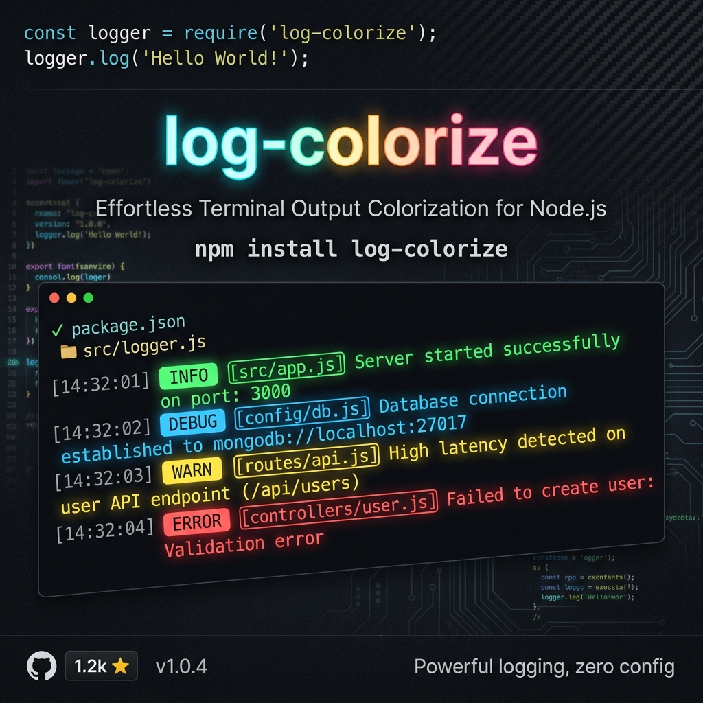

# log-colorize

<p align="center">
  
</p>

<p align="center">
  <strong>Fast, colorful console logging for Node.js, React, and Next.js projects.</strong><br />
  Automatically prints caller file paths with clickable line numbers, ANSI colors in terminal, and CSS styling in browser DevTools.
</p>

<p align="center">
  <a href="https://www.npmjs.com/package/log-colorize"></a>
  <a href="./LICENSE"></a>
  
  
</p>

---

## ✨ Features

- 🎨 **Cross-Environment**: ANSI colors in Node.js terminals & `%c` CSS colors in Browser DevTools.
- 📍 **Clickable File Paths**: Automatically detects caller `file:line:col` for instant Ctrl+Click jumping in VS Code.
- ⚡ **Single Clean API**: Simple `log(message, type)` design.
- 🚨 **First-Class Error Support**: Pass Error objects directly (`log(err, "error")`) to log stack traces cleanly.
- 🎛️ **Severity Level Filtering**: Mute lower-severity logs globally (e.g. `configure({ level: "warning" })`).
- ⚡ **Zero Dependencies**: Lightweight, fast, and tree-shakeable.
- 🌐 **Next.js & React Ready**: Works seamlessly in both Server Components (SSR) and Client Components.

---

## 📦 Installation

```bash
npm install log-colorize
```

or with yarn / pnpm / bun:

```bash
yarn add log-colorize
pnpm add log-colorize
bun add log-colorize
```

---

## 🚀 Quick Start

```typescript
import { log } from "log-colorize";

// Log with different severities (default is "info")
log("User registered successfully", "success");  // ✔ SUCCESS  src/auth.ts:14:1  User registered successfully
log("DB connection timeout", "error");           // ✖ ERROR    src/db.ts:42:1    DB connection timeout
log("API response time > 500ms", "warning");     // ⚠ WARNING  src/api.ts:8:1    API response time > 500ms
log("Server running on port 3000", "info");      // ℹ INFO     src/index.ts:2:1  Server running on port 3000
log("Starting background worker");               // ℹ INFO     src/index.ts:5:1  Starting background worker
```

### CommonJS (Node.js)

```javascript
const { log } = require("log-colorize");

log("Server started", "success");
```

---

## 🛠️ Features & Usage

### 1. Passing Error Objects

Pass `Error` instances directly to print formatted error messages and stack traces:

```typescript
try {
  JSON.parse("invalid json");
} catch (err) {
  log(err, "error");
}
// Output:
// ✖ ERROR  src/parser.ts:5:1
//   SyntaxError: Unexpected token 'i', "invalid json" is not valid JSON
//       at JSON.parse (<anonymous>)
//       at parseData (src/parser.ts:3:8)
```

---

### 2. Global Configuration `configure()`

Call `configure()` once at the entry point of your app to customize logging behavior:

```typescript
import { configure } from "log-colorize";

configure({
  showPath: false,      // Hide caller file path (useful in production)
  colorsEnabled: false, // Strip ANSI/CSS colors (useful in plain text CI logs)
  level: "warning",     // Severity filter: only logs >= warning will print
});
```

#### Severity Hierarchy (`level` option):

| Level | Printable Types |
| :--- | :--- |
| `"success"` | `success`, `info`, `warning`, `error` (All logs) |
| `"info"` | `info`, `warning`, `error` |
| `"warning"` | `warning`, `error` |
| `"error"` | `error` only |

---

## ⚛️ React & Next.js Examples

### React Component

```tsx
import React from "react";
import { log } from "log-colorize";

export function SaveButton() {
  const handleSave = async () => {
    try {
      await api.saveData();
      log("Data saved successfully!", "success");
    } catch (err) {
      log(err, "error");
    }
  };

  return <button onClick={handleSave}>Save</button>;
}
```

### Next.js (Server & Client Components)

```tsx
// Server Component / API Route (Node.js ANSI Terminal)
import { log } from "log-colorize";

export async function GET() {
  log("Fetching user profile", "info");
  return Response.json({ status: "ok" });
}
```

```tsx
// Client Component (Browser %c CSS DevTools)
"use client";
import { log } from "log-colorize";
import { useEffect } from "react";

export default function UserProfile() {
  useEffect(() => {
    log("Component mounted", "info");
  }, []);

  return <div>Profile Page</div>;
}
```

---

## 🛠️ Development & Testing

Run local tests:

```bash
npm run build
node test/test.js
```

Run the React demo:

```bash
cd react-demo
npm run dev
```

---

## 📤 Step-by-Step Guide: Pushing to GitHub & NPM

### Step 1: Git & GitHub Setup

1. Initialize git and commit files:
   ```bash
   git init
   git add .
   git commit -m "feat: complete log-colorize package implementation"
   ```

2. Link your GitHub repository and push:
   ```bash
   git branch -M main
   git remote add origin https://github.com/YOUR_USERNAME/log-colorize.git
   git push -u origin main
   ```

---

### Step 2: Publish to NPM

1. **Update `package.json`** with your information:
   Ensure `author`, `repository.url`, `bugs.url`, and `homepage` in `package.json` match your GitHub/NPM username.

2. **Login to NPM**:
   ```bash
   npm login
   ```

3. **Publish the package**:
   ```bash
   npm publish --access public
   ```

4. **Future Version Bumps**:
   ```bash
   npm version patch   # 1.0.0 -> 1.0.1 (bug fix)
   npm version minor   # 1.0.0 -> 1.1.0 (new feature)
   npm version major   # 1.0.0 -> 2.0.0 (breaking change)

   npm publish --access public
   ```

---

## 📄 License

[MIT](./LICENSE)
